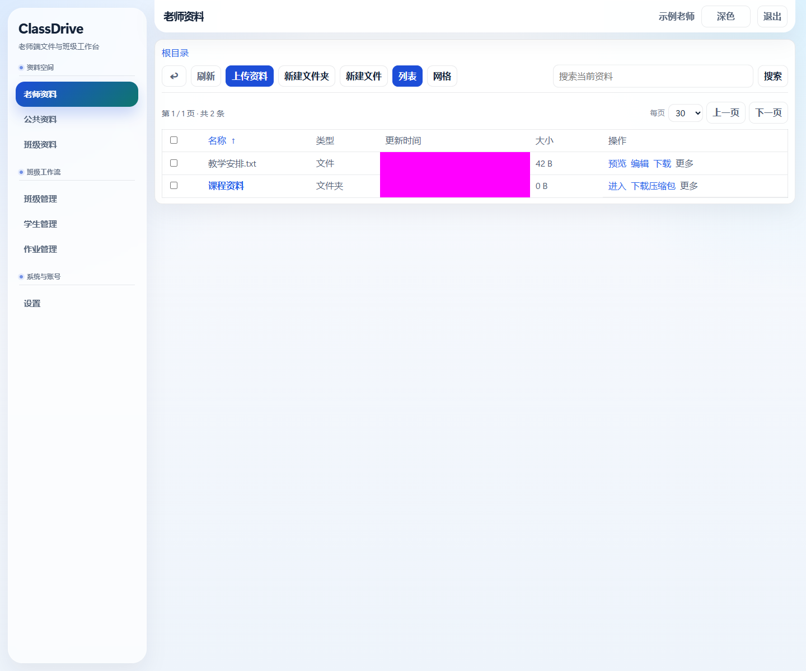
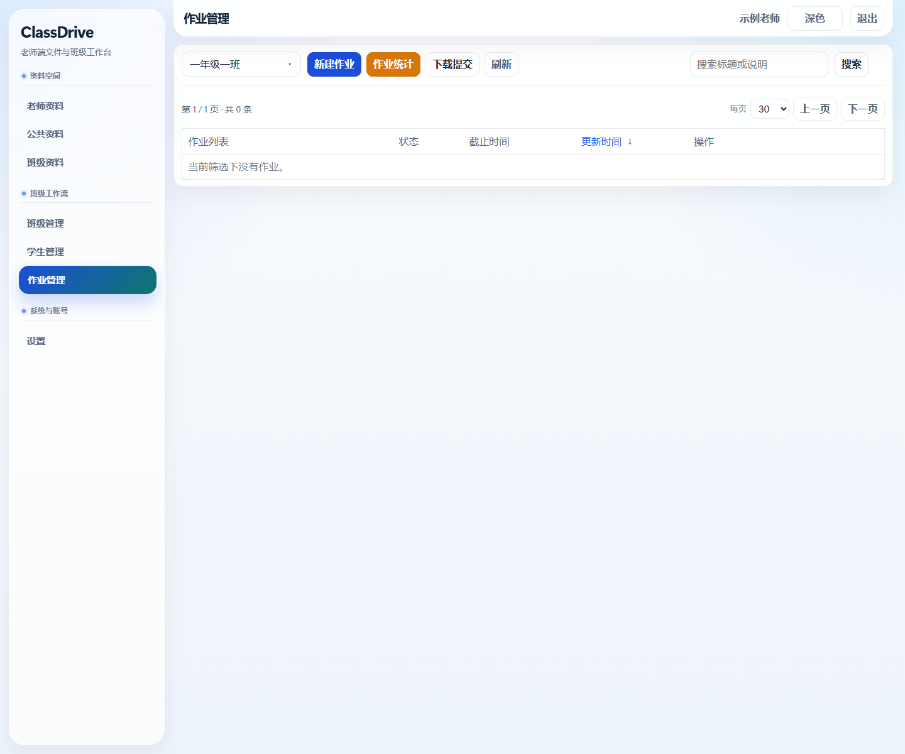
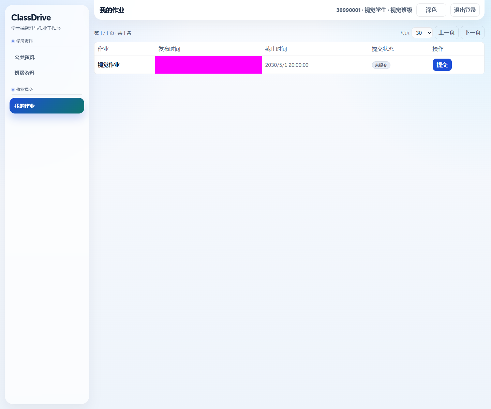
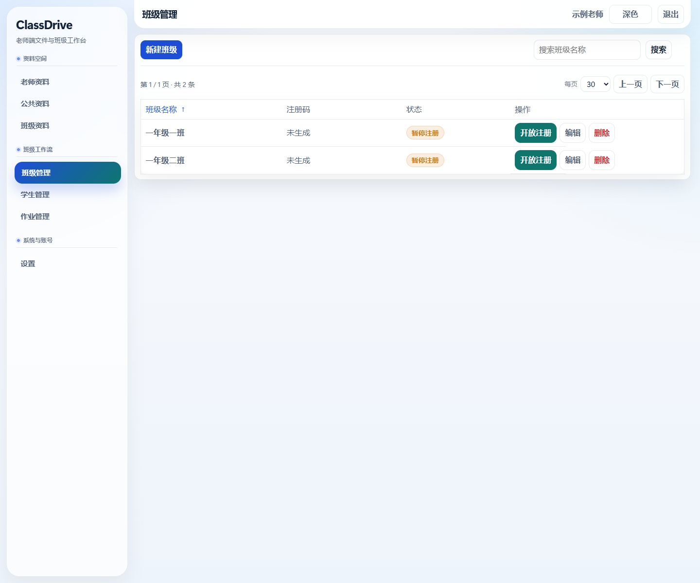
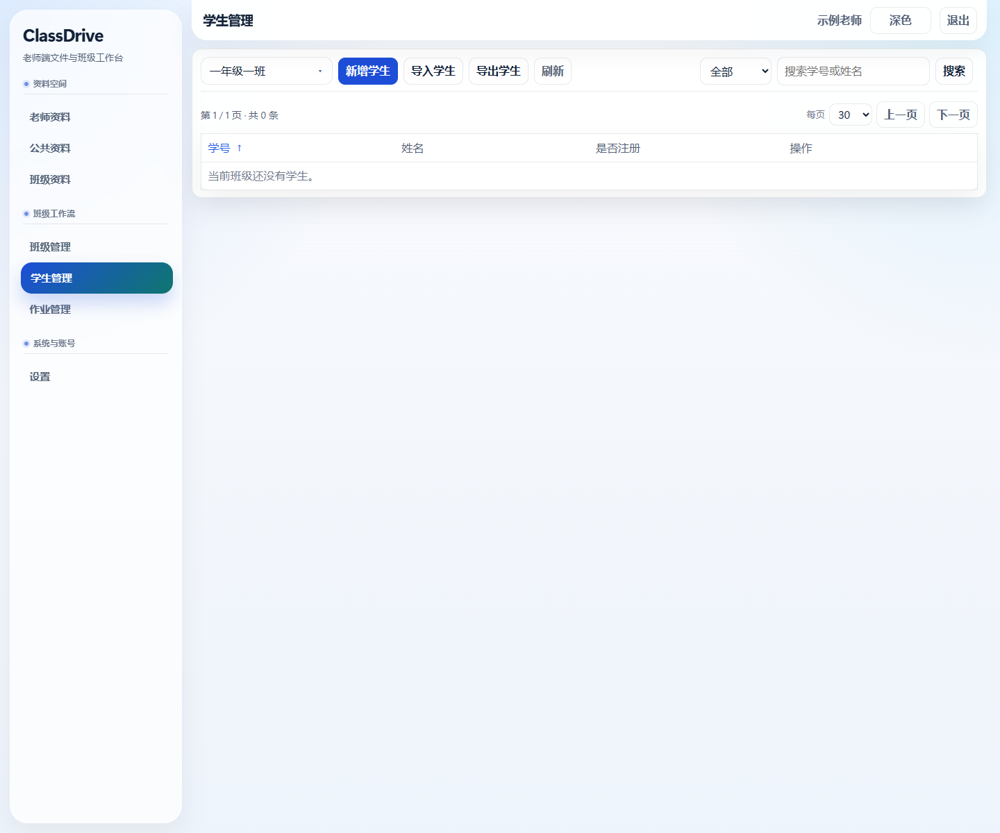

# ClassDrive

ClassDrive 是一个面向课堂教学的局域网文件与作业工作台。它把教师资料、公共资料、班级资料、学生名单、作业发布、作业提交与批改集中到一个轻量 Web 应用中，适合在机房、教室局域网或教师个人电脑上直接部署。



## 适用人群

- 中小学、中职、高职和高校任课教师
- 需要在课堂内分发素材、收取作业、批量检查提交情况的教学场景
- 希望用一台电脑在局域网内临时提供资料空间的教师或实训室管理员
- 需要区分教师端和学生端，但不想部署复杂网盘系统的小型教学团队

## 适用场景

- 课堂素材分发：教师上传课件、案例、图片、视频、压缩包，学生只读查看和下载
- 机房实训：按班级管理资料，学生在本班空间查找任务文件
- 作业收发：教师发布作业要求，学生提交文件或文件夹，系统保留目录层级
- 批量批阅：教师按学生查看提交文件，预览图片、PDF、音视频、文本等常见格式
- 提交统计：按一次或多次作业统计已交、未交次数，并导出 Excel

## 界面预览

| 教师端作业管理 | 学生端作业列表 |
| --- | --- |
|  |  |

| 班级管理 | 学生管理 |
| --- | --- |
|  |  |

## 核心能力

- 单程序交付：Go 后端嵌入 Vue 3 前端构建产物
- 三类资料空间：老师资料、公共资料、班级资料
- 文件操作：上传、拖拽上传、目录上传、复制、移动、重命名、删除、下载、批量下载
- 文件预览：图片、PDF、音视频、文本等浏览器可直接处理的格式
- 作业闭环：创建、发布、取消发布、编辑、删除、附件管理、提交统计
- 学生端：激活、登录、查看资料、查看作业、按要求提交或重新提交
- 学生管理：新增学生、Excel 导入、模板下载、密码重置
- 教师账号：负责人和普通教师权限边界，支持账号管理和禁用
- 深色模式：教师端与学生端主要页面已适配

## 快速开始

### 使用已打包程序

1. 运行 `ClassDrive.exe`。
2. 浏览器打开控制台输出的访问地址。
3. 首次登录使用默认教师账号：
   - 用户名：`admin`
   - 密码：`demo123`
4. 登录后请及时修改默认密码。

程序会在运行目录下创建 `var/`，用于保存数据库、资料文件、学生提交和运行数据。该目录包含本地数据，不应提交到 Git 仓库。

### 从源码运行

```powershell
npm --prefix frontend install
npm run build
go run ./cmd/classdrive
```

默认监听 `80` 端口。若没有管理员权限或端口被占用，可以指定端口：

```powershell
$env:CLASSDRIVE_PORT = "666"
go run ./cmd/classdrive
```

### 打包 Windows exe

```powershell
npm run build
go build -o tmp/ClassDrive.exe ./cmd/classdrive
```

`tmp/ClassDrive.exe` 适合放到 GitHub Release 附件中，不建议直接提交到源码仓库。

## 技术栈

- 后端：Go、标准库 HTTP、SQLite WAL
- 前端：Vue 3、TypeScript、Vite、Pinia、Vue Router、Element Plus
- 测试：Vitest、Vue Test Utils、Playwright
- 数据：本地 SQLite 数据库与本地文件系统

## 开发验证

在项目根目录执行：

```powershell
npm run typecheck
npm test
go test ./... -count=1
```

完整本地检查：

```powershell
npm run verify:full
npm run test:e2e
```

视觉回归：

```powershell
npm run test:visual
npm run test:visual:update
```

视觉基线位于 `frontend/e2e/00-visual.spec.ts-snapshots/`。

## 目录结构

```text
cmd/classdrive/        应用入口
internal/server/       后端业务、HTTP API、SQLite 数据层、前端嵌入资源
frontend/              Vue 3 + TypeScript 前端
scripts/               本地验证脚本
```

## 注意事项

- 当前项目面向单机或局域网部署，不是公网高并发网盘。
- 本工程不兼容旧 `go-drive` 数据。
- 开源提交时不要提交 `.tooling/`、`node_modules/`、`var/`、`tmp/`、测试结果和本地日志。
- 正式开源前建议补充 `LICENSE`，明确授权协议。
