# ClassDrive

ClassDrive 是一个面向课堂教学的局域网文件与作业工作台。它把教师资料、公共资料、班级资料、学生名单、作业发布、学生提交、批改、未交统计和提交包下载集中到一个轻量 Web 应用中，适合在机房、教室局域网或教师个人电脑上直接部署。

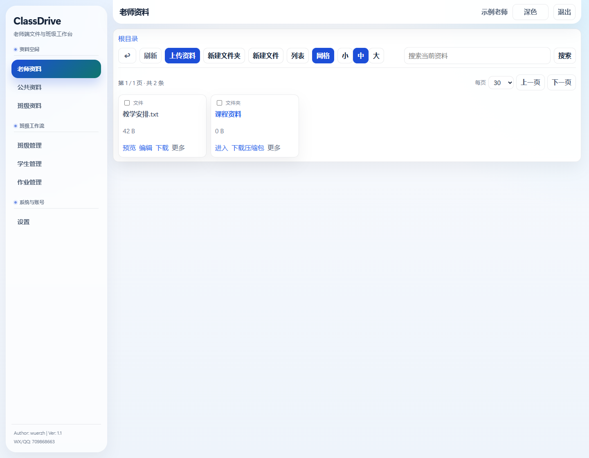

## 适用人群

- 中小学、中职、高职和高校任课教师。
- 需要在课堂内分发素材、收取作业、批量检查提交情况的教学场景。
- 希望用一台电脑在局域网内临时提供资料空间的教师或实训室管理员。
- 需要区分教师端和学生端，但不想部署复杂网盘系统的小型教学团队。

## 典型场景

- 课堂素材分发：教师上传课件、案例、图片、视频、压缩包，学生只读查看和下载。
- 机房实训：按班级管理资料，学生在本班空间查找任务文件。
- 作业收发：教师发布作业要求，学生提交文件或文件夹，系统保留目录层级。
- 批量批阅：教师按学生查看提交文件，预览图片、PDF、音视频、文本等常见格式，并保存批改状态与评语摘要。
- 提交统计：按一次或多次作业统计已交、未交次数，查看单次作业未交名单，并导出 Excel。
- 提交归档：按作业和学生整理提交包，下载时保留原文件夹层级，并附带提交清单、未提交清单。

## 功能总览

### 教师端

- 资料空间：老师资料、公共资料、班级资料三类空间，支持上传文件、上传文件夹、拖拽上传、新建文件夹、新建文本文件、复制、移动、重命名、删除、搜索、排序、批量下载和批量操作。
- 文件预览：支持浏览器可直接处理的图片、PDF、音视频、文本等格式；文本文件可在线编辑。
- 班级管理：创建、编辑、删除班级，开启或关闭学生注册码，按班级隔离资料、学生、作业和提交。
- 学生管理：新增学生、Excel 导入、模板下载、导出学生、按注册状态筛选、重置密码、删除学生。
- 作业管理：按班级筛选作业，搜索、分页、排序；支持草稿、发布、取消发布、复制到班级。
- 作业创建与编辑：可设置标题、说明、截止时间、发布状态、提交方式、提交格式和最少文件数；支持作业附件管理。
- 批改工作台：按姓名、学号或评语搜索提交，支持上一条/下一条、列表/网格查看提交文件、预览和下载、保存批改状态与评语、一键批改本作业。
- 统计与导出：支持多作业已交/未交次数统计、单作业未交名单、Excel 导出、多作业提交包下载。
- 系统与账号：教师个人设置、端口配置、老师账号管理、登录日志和操作日志审计。

### 学生端

- 首次激活：学生使用班级注册码、学号和自设密码激活账号。
- 学习资料：查看公共资料和本班资料，支持搜索、预览和下载。
- 我的作业：查看已发布作业、提交状态、发布时间和截止时间。
- 作业详情：查看提交要求、格式限制、文件大小、截止时间和教师附件。
- 作业提交：按教师要求选择文件或文件夹，提交前校验格式和数量；截止前可重新提交并覆盖当前提交。
- 当前提交：支持列表/网格查看已提交内容，预览可处理文件，下载单个文件或文件夹压缩包；截止后进入只读状态。

## 界面预览

| 教师端作业管理 | 新建作业 |
| --- | --- |
| 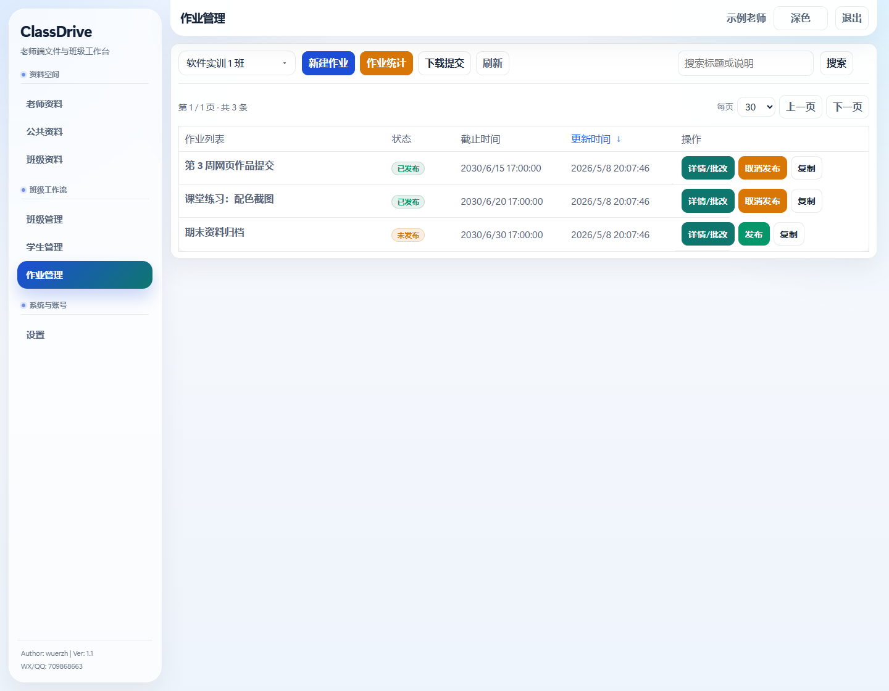 | 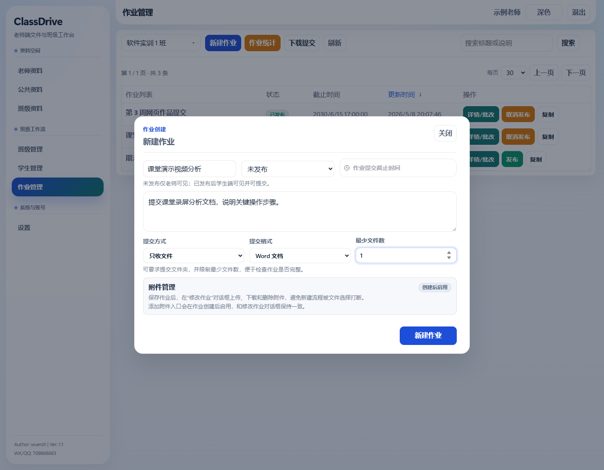 |

| 多作业统计 | 作业详情与提交列表 |
| --- | --- |
| 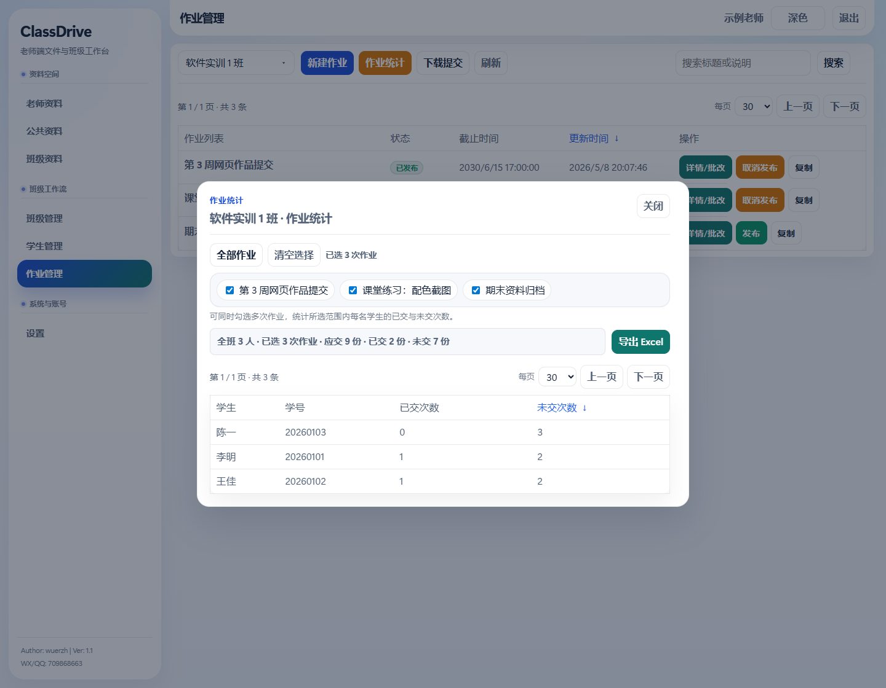 | 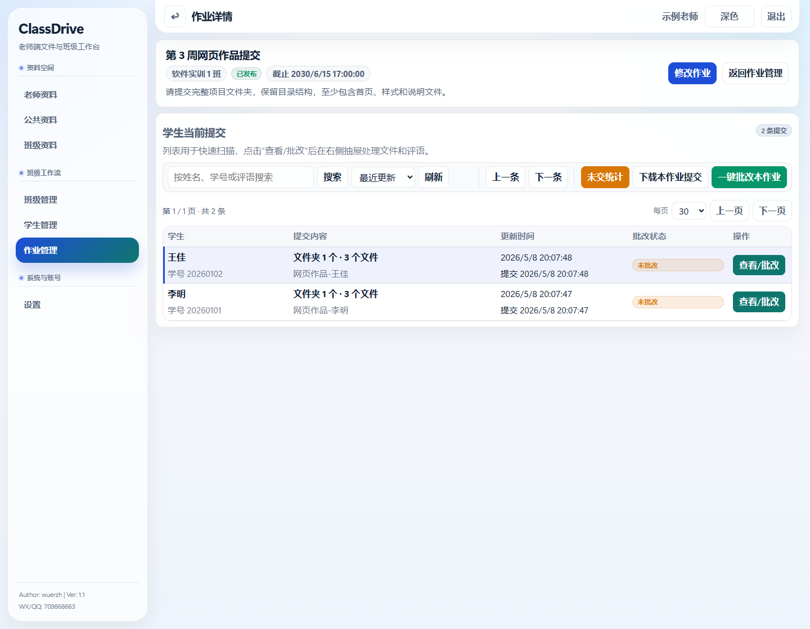 |

| 单作业未交名单 | 提交详情与批改 |
| --- | --- |
| 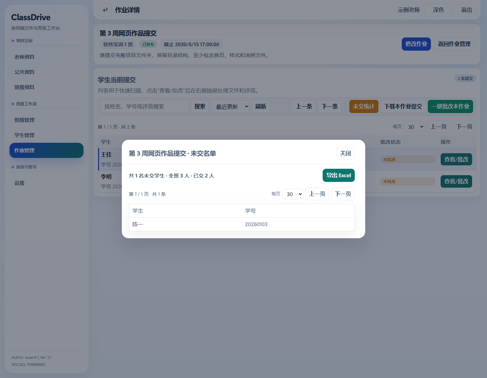 | 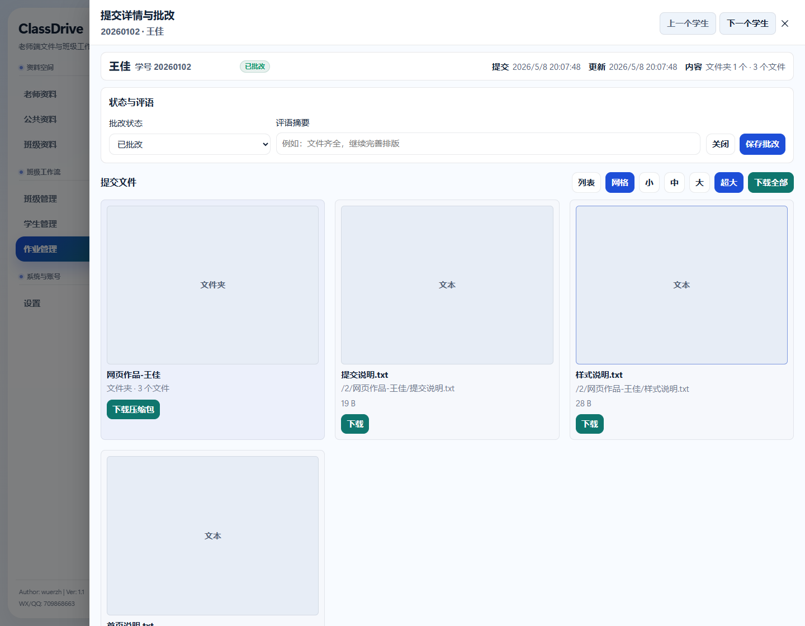 |

| 学生端作业列表 | 学生端作业提交 |
| --- | --- |
| 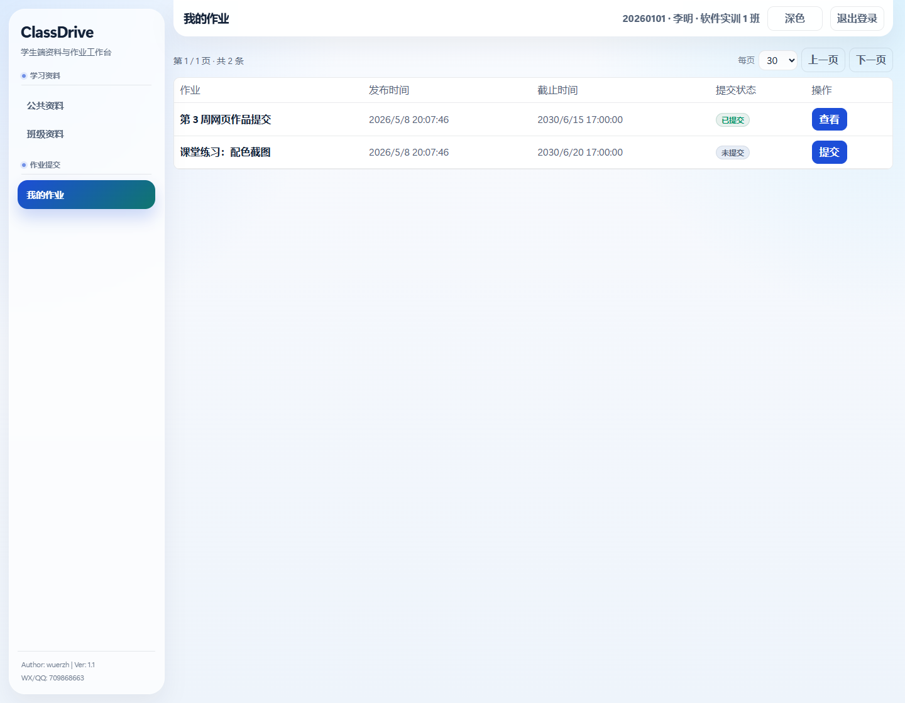 | 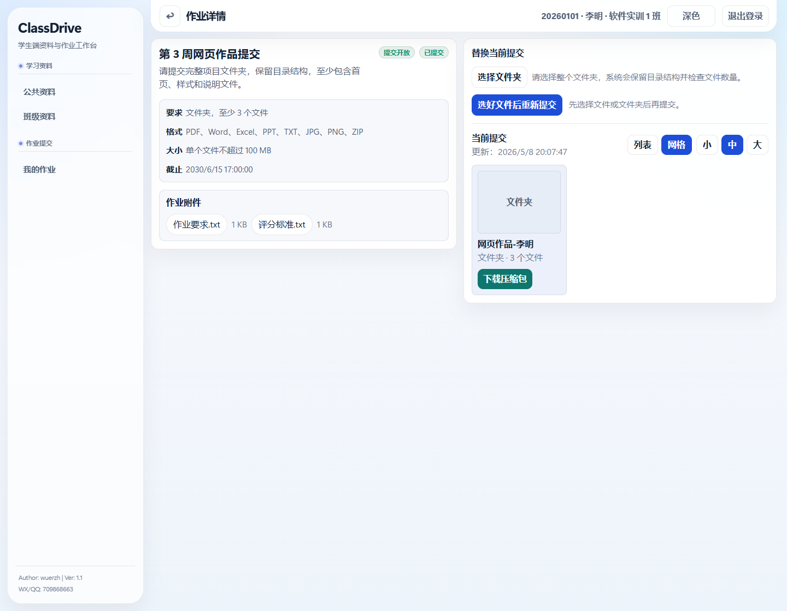 |

| 班级管理 | 学生管理 |
| --- | --- |
| 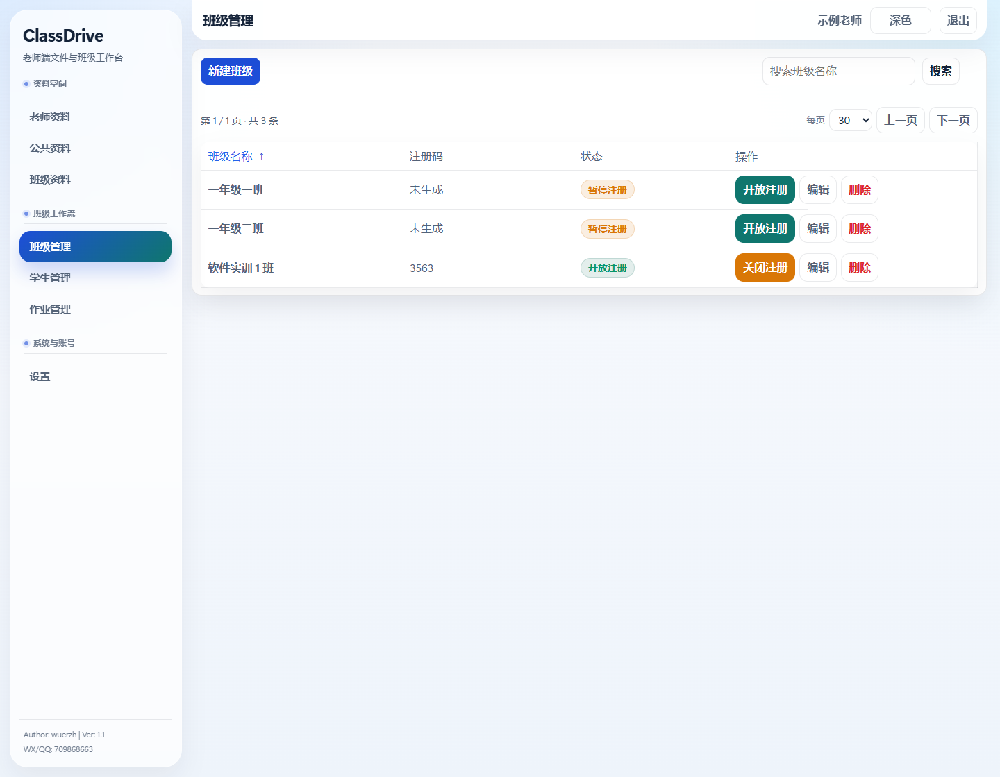 | 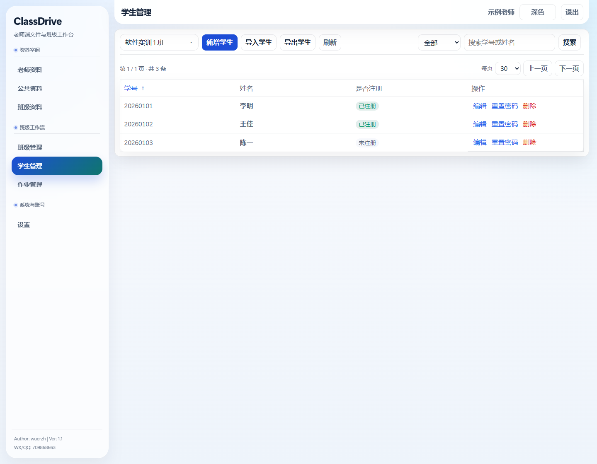 |

## 快速开始

### 使用已打包程序

1. 运行 `ClassDrive.exe`。
2. 浏览器打开控制台输出的访问地址。
3. 首次登录使用默认教师账号：
   - 用户名：`admin`
   - 密码：`demo123`
4. 登录后请及时修改默认密码。

程序会在运行目录下创建 `var/`，用于保存数据库、资料文件、学生提交和运行数据。该目录包含本地数据，不应提交到 Git 仓库。

### 从源码运行

```powershell
npm --prefix frontend install
npm run build
go run ./cmd/classdrive
```

默认监听 `80` 端口。若没有管理员权限或端口被占用，可以指定端口：

```powershell
$env:CLASSDRIVE_PORT = "666"
go run ./cmd/classdrive
```

### 打包 Windows exe

```powershell
npm run build
go build -o tmp/ClassDrive.exe ./cmd/classdrive
```

`tmp/ClassDrive.exe` 适合放到 GitHub Release 附件中，不建议直接提交到源码仓库。

## 操作指引

### 教师：资料分发

1. 登录教师端，进入“老师资料”“公共资料”或“班级资料”。
2. 选择目标空间和班级资料目录。
3. 使用“上传资料”上传文件或文件夹，也可以拖拽上传。
4. 需要分发到其他空间时，勾选条目后使用“批量复制”或“批量移动”。
5. 学生端只能访问公共资料和自己班级的班级资料。

### 教师：班级和学生

1. 进入“班级管理”，新建班级。
2. 在班级行内开启注册码，学生首次激活时需要使用该注册码。
3. 进入“学生管理”，选择班级后新增学生，或下载模板并批量导入。
4. 若学生忘记密码，可在学生行内重置密码；学生登录后需按系统要求修改初始密码。

### 教师：发布作业

1. 进入“作业管理”，选择班级。
2. 点击“新建作业”，填写标题、说明、截止时间和发布状态。
3. 按课堂要求选择提交方式：
   - “不限”：学生可提交文件或文件夹。
   - “只收文件”：学生只能选择一个或多个文件。
   - “只收文件夹”：学生必须选择整个文件夹，系统保留目录层级。
4. 选择提交格式：常用文件、图片文件、Word 文档、PDF 文件或压缩包。
5. 设置最少文件数，用于检查提交是否完整。
6. 创建后进入“详情/批改”或“修改作业”，可上传作业附件。
7. 确认内容后发布；草稿作业仅教师可见。

### 教师：批改和统计

1. 在作业列表点击“详情/批改”，进入单次作业工作台。
2. 使用搜索、排序、分页快速定位学生提交。
3. 点击“查看/批改”，在抽屉中查看学生提交文件；可切换列表/网格、预览、下载。
4. 选择批改状态，填写评语摘要，点击“保存批改”。
5. 需要快速收尾时，可使用“一键批改本作业”。
6. 点击“未交统计”查看当前作业未交学生，并可导出 Excel。
7. 在作业列表点击“作业统计”，可同时勾选多次作业，统计每名学生已交与未交次数。
8. 点击“下载提交”或“下载本作业提交”导出提交包，压缩包会按作业和学生归档，并包含清单文件。

### 学生：激活和提交作业

1. 打开学生端，首次使用点击“首次使用先激活”。
2. 输入班级注册码、学号和新密码完成激活。
3. 进入“我的作业”，查看作业状态和截止时间。
4. 打开作业详情，阅读要求、格式、大小限制和教师附件。
5. 按要求选择文件或文件夹，确认已选择内容后提交。
6. 截止前可重新选择并提交，新的提交会替换当前提交。
7. 提交后可在“当前提交”中查看、预览或下载自己的提交内容。

## 技术栈

- 后端：Go、标准库 HTTP、SQLite WAL
- 前端：Vue 3、TypeScript、Vite、Pinia、Vue Router、Element Plus
- 测试：Vitest、Vue Test Utils、Playwright
- 数据：本地 SQLite 数据库与本地文件系统

## 开发验证

在项目根目录执行：

```powershell
npm run typecheck
npm test
go test ./... -count=1
```

完整本地检查：

```powershell
npm run verify:full
npm run test:e2e
```

视觉回归：

```powershell
npm run test:visual
npm run test:visual:update
```

README 截图生成：

```powershell
npm run build
npm run capture:readme
```

README 截图位于 `docs/images/readme/`。视觉回归基线仍由 Playwright 测试维护，两者互不复用。

## 目录结构

```text
cmd/classdrive/        应用入口
internal/server/       后端业务、HTTP API、SQLite 数据层、前端嵌入资源
frontend/              Vue 3 + TypeScript 前端
frontend/scripts/      前端辅助脚本与截图生成脚本
docs/images/readme/    README 使用的截图资产
scripts/               本地验证脚本
```

## 注意事项

- 当前项目面向单机或局域网部署，不是公网高并发网盘。
- 本工程不兼容旧 `go-drive` 数据。
- 开源提交时不要提交 `.tooling/`、`node_modules/`、`var/`、`tmp/`、测试结果和本地日志。
- 正式开源前建议补充或确认 `LICENSE`，明确授权协议。
